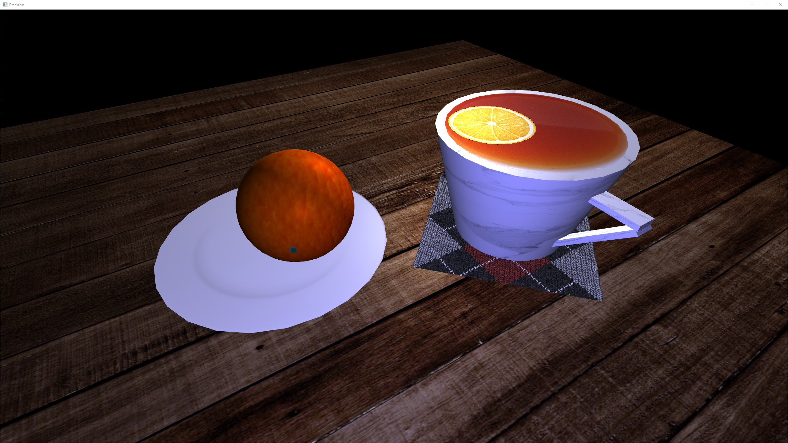
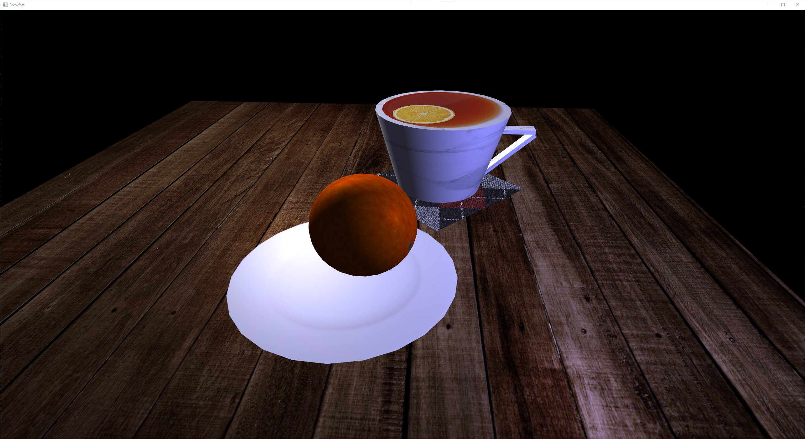
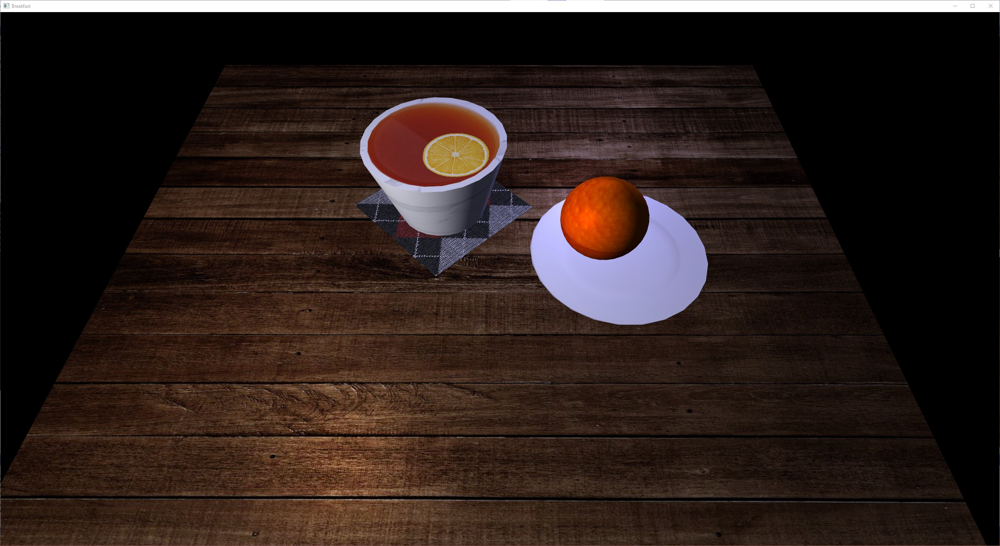
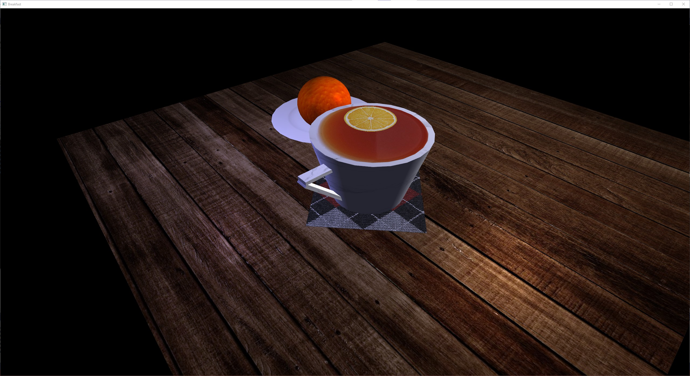
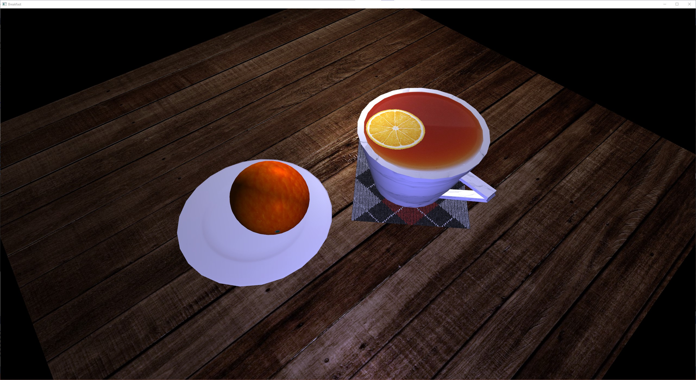

# About the Project
3D rendering of a still photograph using C++ programming language and 
OpenGL library. This is a 3D recreation of a picture of
a teacup and an orange on a wooden table.

# Depth of Project
The project explores linear algebra, model transformations, 
complex texturing, lighting with the Phong model, and input 
devices for navigation.

Programmatic and mathematical techniques are used to generate
primitive shapes such as a sphere, cube, plane, and cylinder in order
to recreate the original photograph's objects.

# YouTube Link to Project Demo
https://www.youtube.com/watch?v=_Ou3yA71gnU

# Sreenshots

# Tools Used
1. **C++** - an object-oriented and lower-level programming language. For
more information about this language, visit https://www.cplusplus.com/
2. **OpenGL** - a widely popular graphics API used for many industries 
and applications. The C++ OpenGL libraries GLEW and GLFW are used in 
this project. For more information about OpenGL, visit 
https://www.khronos.org/opengl/
3. **OpenGL Mathematics (GLM)** - a header-only library that allows
linear algebraic calculations to be performed for graphics processing.
Such calculations include model transformations by multiplying 
vectors and matrices. For more information on GLM, please visit 
https://github.com/g-truc/glm
4. **stb_image.h** - a header-only library for loading images of
various file-types. This library is available at 
https://github.com/nothings/stb